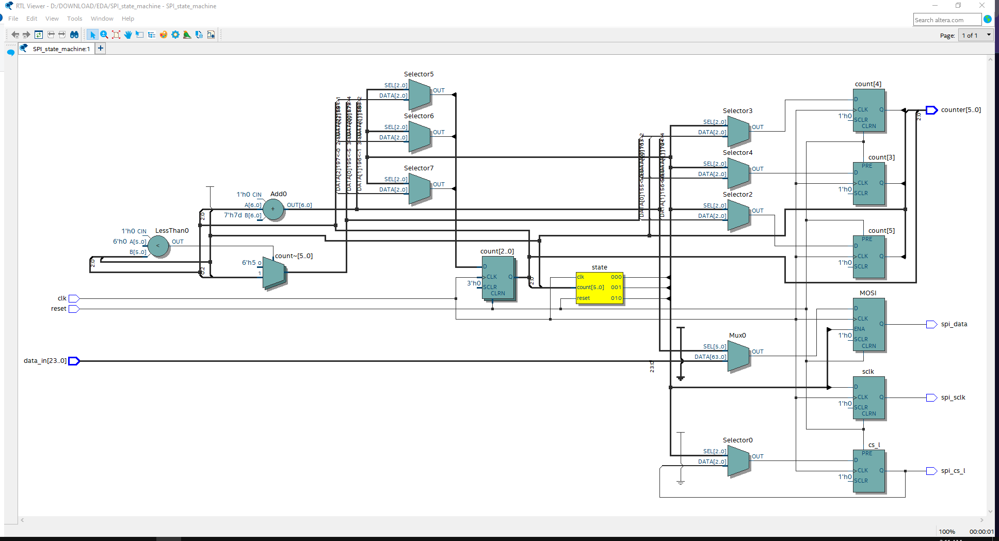
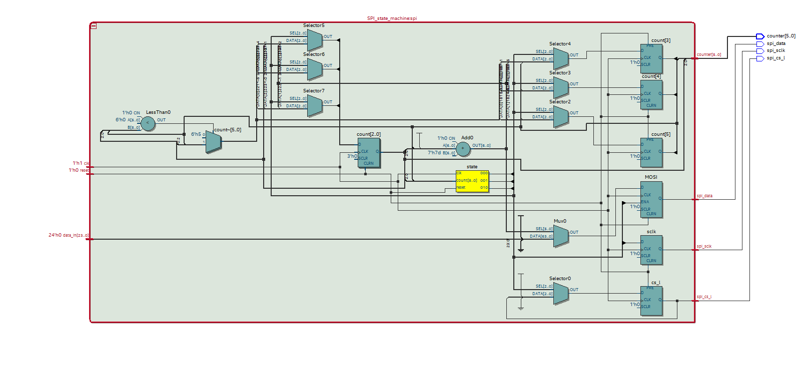

## SPI_demo

### SPI_RTL_design: 

Design:

- load data from mem file and read them into a lookup table
- reformat it from 24 bits into 40 bits command
- use shift register to send one bit at a time thru MOSI line

RTL design for SPI

RTL design for SPI wrapper - pass `fileName` as parameter

